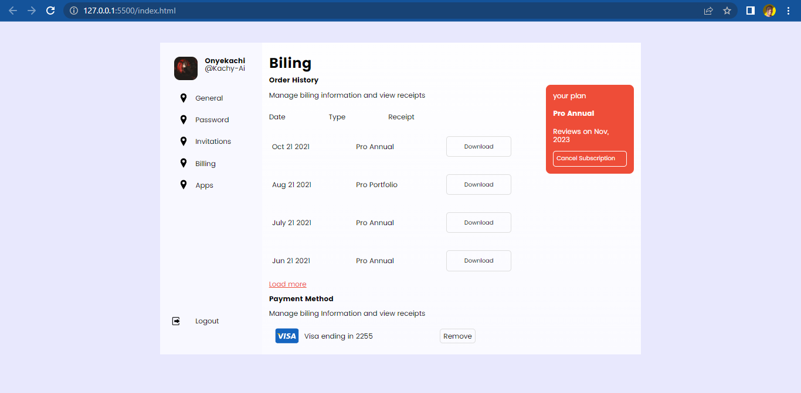

# Billing-ui solution

## Table of contents

- [Overview]
  - [Links](#links)
- [My process](used a flex container for the body)
  - [Built with](HTML and Css)
  - [What I learned](Didnt really learn anything new, just a recap of my previous knowledge)
- [Author](#Onyekachi Nelson Oriaku{Kachy-AI})
- [Acknowledgments](Myself😁)

## Overview

### Screenshot

### Links

### Built with

- Semantic HTML5 markup
- CSS custom properties
- Flexbox
- Mobile-first workflow

## Author

- Twitter - [@KachyAi](https://twitter.com/KachyAi)

## Acknowledgments

I worked on this alone, its a really nice project and id say i thank traversy, Kevin powell and Web Dev Simplified for guiding me to my web dev journey.
